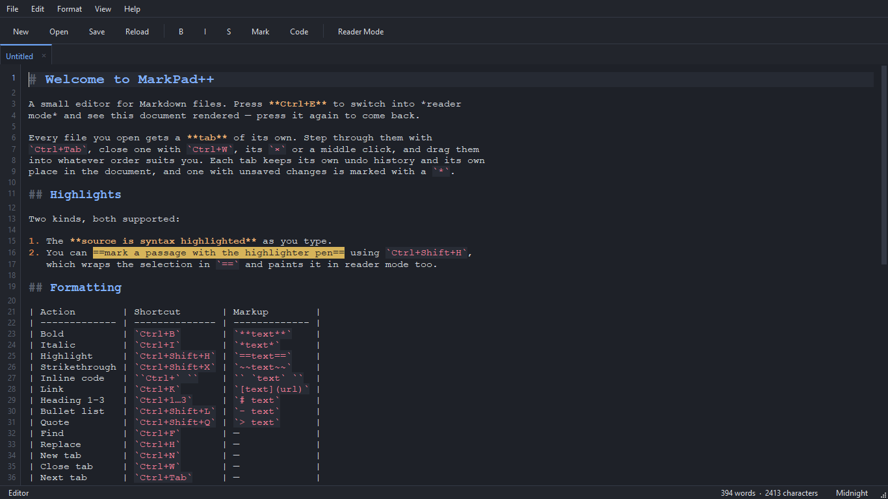

# MarkPad++

**A free, offline Markdown editor for Windows — open and edit `.md` files, and export them to PDF, Word or ODT.**

MarkPad++ is a small Windows desktop app for reading and writing Markdown. It has
tabbed editing in the style of Notepad++, a reader mode that renders the document
in place (`Ctrl+E`), find and replace, a highlighter pen, and export to PDF,
`.docx` and `.odt`. It requires no account, works entirely offline, and sends no
telemetry. Current version: **1.0.3**.

This repository is the public home for MarkPad++: its documentation, and its
issue tracker. **It contains no source code** — the application is closed source.
Use [Issues](https://github.com/vkuksynok/MarkPadPP/issues) to report bugs and
request features.

## Install

The recommended way to install MarkPad++ is the Microsoft Store, which also
delivers updates automatically. A direct installer is available as well.

- **Microsoft Store (recommended):** https://apps.microsoft.com/detail/9PCKKT5MKL4L
- **Direct download:** the latest `MarkPadPP-<version>-x64-setup.exe` on the
  [Releases page](https://github.com/vkuksynok/MarkPadPP/releases/latest). Updates
  are manual with this option.

<!-- TODO: winget — add once a winget-pkgs manifest is submitted. -->

## Features

- Tabbed editing, one tab per open file, in the style of Notepad++.
- Reader mode toggled with `Ctrl+E`, rendering the document in place and keeping
  your scroll position in both directions.
- Markdown syntax highlighting in the source view, live as you type.
- Highlighter pen: `==text==` paints a passage in both the editor and the
  rendered page.
- Toggling shortcuts for bold, italic, highlight, strikethrough, inline code,
  links, headings, bullet lists and quotes.
- Find and replace with every hit highlighted at once, wrap-around, and optional
  case-sensitive and whole-word matching.
- Export the rendered document to PDF, Microsoft Word (`.docx`) and OpenDocument
  Text (`.odt`).
- Built-in light and dark themes covering the editor, the chrome, the rendered
  page and the native Windows title bar.
- Recent files list, ten entries deep.
- Drag and drop several files onto the window at once.
- Single instance: opening a file adds a tab to the existing window.
- Works entirely offline, with no account and no telemetry.

## Supported file types

MarkPad++ opens and edits Markdown files (`.md`), always read and written as UTF-8.

Exported documents can be written in three formats:

| Export format | Extension |
| --- | --- |
| PDF | `.pdf` |
| Microsoft Word | `.docx` |
| OpenDocument Text | `.odt` |

<!-- TODO: confirm the full list of file extensions the app associates with / opens (e.g. .markdown, .mdown, .mkd, .txt), not just .md. -->

## Keyboard shortcuts

Formatting shortcuts toggle: applying a format a second time removes it, and
heading shortcuts replace an existing heading level rather than stacking onto it.

| Action | Shortcut | Markup |
| --- | --- | --- |
| Bold | `Ctrl+B` | `**text**` |
| Italic | `Ctrl+I` | `*text*` |
| Highlight | `Ctrl+Shift+H` | `==text==` |
| Strikethrough | `Ctrl+Shift+X` | `~~text~~` |
| Inline code | `` Ctrl+` `` | `` `text` `` |
| Link | `Ctrl+K` | `[text](url)` |
| Heading 1–3 | `Ctrl+1` … `Ctrl+3` | `# text` |
| Bullet list | `Ctrl+Shift+L` | `- text` |
| Quote | `Ctrl+Shift+Q` | `> text` |
| Reader mode | `Ctrl+E` | — |
| Find | `Ctrl+F` | — |
| Replace | `Ctrl+H` | — |
| Find next | `F3` | — |
| Find previous | `Shift+F3` | — |
| New tab | `Ctrl+N` | — |
| Close tab | `Ctrl+W` | — |
| Close all tabs | `Ctrl+Shift+W` | — |
| Next tab | `Ctrl+Tab` / `Ctrl+PgDown` | — |
| Previous tab | `Ctrl+Shift+Tab` / `Ctrl+PgUp` | — |

<!-- TODO: confirm whether standard File/Edit shortcuts (Save Ctrl+S, Open Ctrl+O, Undo/Redo, etc.) exist and should be documented — they are not listed in the site materials. -->

## System requirements

| Requirement | Value |
| --- | --- |
| Operating system | Windows 10 version 1809 (build 17763) or newer; Windows 11 |
| Architecture | x64 |
| Installation | Microsoft Store (installs and updates through the Store) |
| Internet connection | Not required after installation |
| Account | No account required to use the app (a Store account is needed to install it, as with any Store app) |

## FAQ

### How do I open a `.md` file on Windows?

Install MarkPad++ from the Microsoft Store, then open the `.md` file from
**File › Open**, by dropping it onto the window, or by passing it on the command
line. Each file opens in its own tab.

### How do I preview rendered Markdown?

Press `Ctrl+E` to toggle reader mode. The document is rendered in place, using the
current theme, and returns you to the same scroll position when you toggle back —
there is no split pane to manage.

### Can MarkPad++ convert Markdown to PDF or Word?

Yes. **File › Export** writes the rendered document to PDF (`.pdf`), Microsoft
Word (`.docx`) or OpenDocument Text (`.odt`), carrying over formatting, tables,
links and images. Export to HTML is not available.

### Is MarkPad++ free?

Yes, entirely. There is no trial period, no paid tier, no subscription, no in-app
purchase and no advertising.

### Does it need an account or an internet connection?

No to both. MarkPad++ works entirely offline, never asks you to sign in to read
your own notes, and sends no telemetry.

### How does it compare to Notepad++?

The tab model is deliberately the same — one tab per file, each with its own text,
undo history and caret. MarkPad++ is Markdown-specific rather than a general text
editor, and adds a rendered reader mode, a highlighter pen and document export.

## Links

- **Website:** https://openmdfiles.download/
- **Documentation:** [`docs/`](docs/index.md) · full docs at https://openmdfiles.download/Docs.dc.html
- **Changelog:** [`CHANGELOG.md`](CHANGELOG.md)
- **Report a bug or request a feature:** https://github.com/vkuksynok/MarkPadPP/issues
- **Microsoft Store:** https://apps.microsoft.com/detail/9PCKKT5MKL4L

---

MarkPad++ is developed by Volodymyr Kuksynok. Built with C++ and Qt.
